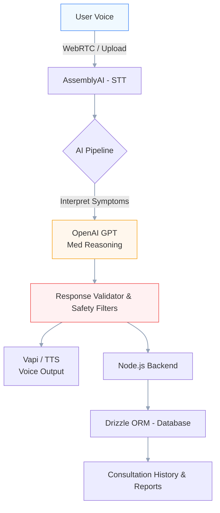

<!--
  High‑fi, animated README for DiagnoseAI
  Replace demo GIF / assets and badges with real links in the repo
-->

<div align="center">

# 🩺 DiagnoseAI
### Voice-First • Safety-Driven • Built for Real Healthcare

<p>
  
  
  
  
  
</p>

<br/>

<!-- Animated typing headline -->
<p align="center">
  
</p>

</div>

---

A voice-first, medically constrained AI assistant built for real healthcare frontlines — not a generic chatbot. Users speak naturally and receive structured, safety-filtered, voice-enabled guidance and a persistent consultation record.

Live demo: https://diagnoseai-ai-medical-system.onrender.com/ • Report issues: https://github.com/PriyankaAsthana/DiagnoseAI---AI-MEDICAL-DIAGNOSIS-SYSTEM-/issues

<!-- Hero GIF (replace with a recorded demo in /assets/demo.gif) -->
<div align="center">
  
</div>

---

## Table of contents

- [Why DiagnoseAI](#why-diagnoseai)
- [Core Capabilities](#core-capabilities)
- [System Architecture (animated/interactive)](#system-architecture-animatedinteractive)
- [Quick Start](#quick-start)
- [API Examples](#api-examples)
- [Security & Safety Design](#security--safety-design)
- [Intended Use & Disclaimer](#intended-use--disclaimer)
- [Tech Stack](#tech-stack)
- [Roadmap](#roadmap)
- [Contributing & Code of Conduct](#contributing--code-of-conduct)
- [License](#license)

---

## Why DiagnoseAI

If you think "build an AI medical tool = plug in ChatGPT", think again. Real healthcare needs system-level thinking:

- Voice-first UX for elderly & accessibility-focused users
- Medical constraint layers so the model is guarded against harmful hallucinations
- Authenticated sessions and persistent, structured medical reports
- Designed for low-latency, real-time consultations — not a demo-only prototype

---

## Core Capabilities

- 🎙️ Real-time voice capture → accurate STT (AssemblyAI)
- 🧠 Medically constrained LLM reasoning (OpenAI GPT + prompt safety)
- 🔁 Response validator & safety filters (rule + model hybrid)
- 🔊 Low-latency voice output (Vapi or other TTS)
- 🧾 Structured consultation reports persisted with Drizzle ORM
- 🔐 Authentication & session isolation (Clerk)
- 📚 Consultation history and secure retrieval

---

## System Architecture (animated/interactive)

Below is a visual flow — the canonical consultation lifecycle. Replace the Mermaid block with GitHub-rendered Mermaid if enabled or export to an SVG for animation.



Animated/embeddable SVG idea:
- Create a small Lottie or animated SVG that cycles through icons (mic → text → brain → shield → speaker → document).
- Commit as /assets/architecture-lottie.json and embed with a minimal HTML snippet in the repo README preview if supported by your site.

---

## Quick start (developer)

Clone, install, and run locally (example uses Node.js + pnpm):

```bash
# clone
git clone https://github.com/PriyankaAsthana/DiagnoseAI---AI-MEDICAL-DIAGNOSIS-SYSTEM-.git
cd DiagnoseAI---AI-MEDICAL-DIAGNOSIS-SYSTEM-

# install (use pnpm / npm / yarn)
pnpm install

# copy env
cp .env.example .env
# set keys: OPENAI_API_KEY, ASSEMBLYAI_KEY, VAPI_KEY, DATABASE_URL, NEXTAUTH_URL, CLERK_* etc.

# run dev
pnpm dev
```

Frontend: Next.js app available at http://localhost:3000  
Backend: Node API routes (Next handlers) that orchestrate STT, LLM calls, validators, and persistence.

---

## API Examples

Below are representative endpoints. The repo contains full implementations; these examples show usage patterns.

Start a consultation (creates session, returns sessionId):
```http
POST /api/consultation/start
Content-Type: application/json
Authorization: Bearer <session-token>

{
  "language": "en-US",
  "device": "web",
  "metadata": { "age": 62, "sex": "female" }
}
```

Process transcribed symptoms (server-side):
```http
POST /api/consultation/process
Content-Type: application/json
Authorization: Bearer <session-token>

{
  "sessionId": "sess_xxx",
  "transcript": "I've had a fever and cough for three days..."
}
```

Generate structured report:
```http
POST /api/report/generate
Authorization: Bearer <session-token>

{
  "sessionId": "sess_xxx",
  "format": "fhir" // optional: produce FHIR-friendly structure
}
```

Example curl (process):
```bash
curl -X POST "https://your-deploy.com/api/consultation/process" \
  -H "Authorization: Bearer $TOKEN" \
  -H "Content-Type: application/json" \
  -d '{"sessionId":"sess_123","transcript":"I have shortness of breath."}'
```

Typescript client example:
```ts
// apiClient.ts
export async function processTranscript(token: string, sessionId: string, transcript: string) {
  return fetch('/api/consultation/process', {
    method: 'POST',
    headers: { 'Content-Type': 'application/json', Authorization: `Bearer ${token}` },
    body: JSON.stringify({ sessionId, transcript }),
  }).then(res => res.json());
}
```

---

## Safety & Constraint Design

DiagnoseAI is engineered to reduce risk and avoid overconfident medical claims:

- Prompt-level medical boundaries (no definitive diagnosis — only guidance)
- ResponseValidator: rules + model-based sanity checks (red-flag detection)
- Explicit fallbacks: "I’m not sure — please consult a medical professional."
- Logging & auditing for each AI decision step (for review & compliance)
- Role-based access to sensitive consultation records

Design goals: reduce false reassurance, avoid harmful advice, provide clear escalation language.

---

## Intended Use & Medical Disclaimer

IMPORTANT: DiagnoseAI is a research / engineering system and NOT a medical device.

- Outputs are informational and preliminary
- Not a substitute for professional medical opinion
- Encourage immediate medical attention for red flags (severe chest pain, sudden weakness, breathing difficulty, etc.)

Always consult a qualified healthcare provider for diagnosis or treatment decisions.

---

## Tech stack (exact usage)

- AI & Voice: OpenAI GPT (reasoning), AssemblyAI (STT), Vapi / TTS engine (voice output)
- Backend: Node.js, Next.js API routes
- DB & ORM: Drizzle ORM (TypeScript-safe schemas)
- Auth: Clerk
- Frontend: Next.js + React + Tailwind CSS
- Types: TypeScript across stack
- Devops: Vercel / Heroku / DigitalOcean for production (example deployment)

---

## Roadmap (high-priority)

- ✅ Voice-native consultation flow
- ✅ Authenticated sessions & persistent reports
- 🔜 Multilingual voice support
- 🔜 Doctor referral & booking workflows
- 🔜 Wearable health data ingestion (Bluetooth / BLE)
- 🔜 Explainable AI / provenance layer for every recommendation
- 🔜 Regulatory & audit tooling (HIPAA/GDPR readiness)

---

## Contributing

We welcome contributors with healthcare or safety experience.

- Please read CONTRIBUTING.md (create one if missing)
- File sensitive security reports via SECURITY.md
- New features must include a safety review and tests that exercise the ResponseValidator

Code of Conduct: Be respectful. Safety-first mindset required when touching any medical logic.

---

## Maintainers & Acknowledgements

- Maintained by: PriyankaAsthana
- Credits: AssemblyAI, OpenAI, Clerk, Drizzle, Vercel community
- Design & UX: accessibility-first contributors and testers

---

## Assets & Where to Replace

- /assets/demo-placeholder.gif → replace with a real recorded demo (screen + audio)
- /assets/architecture-lottie.json → optional Lottie for README or site hero
- /docs/safety-guidelines.md → add your internal safety audit checklist

---

## Security

Security issues should be reported privately: [Create a private issue or email maintainer]. Do NOT post sensitive keys or PII in public issues.

---

## License

Licensed under the MIT License — see LICENSE for details.
